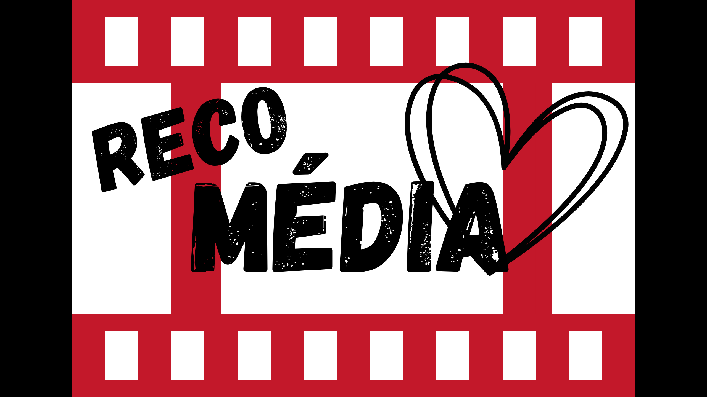
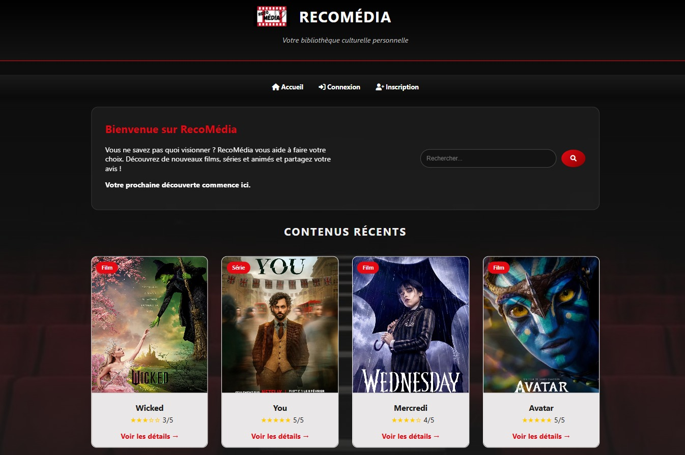
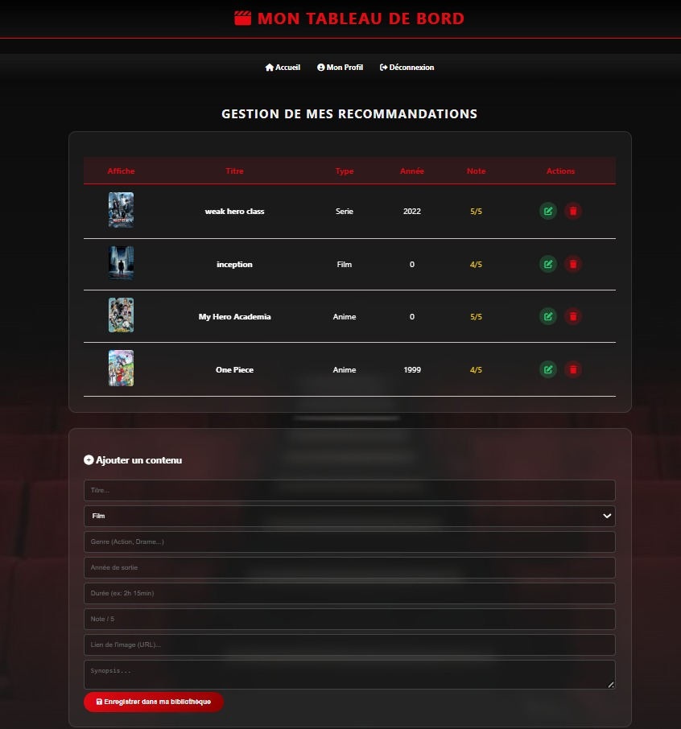
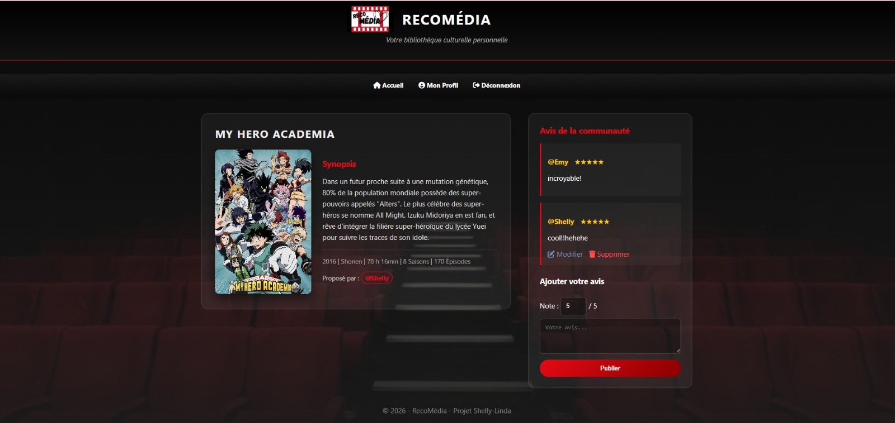

# PROJET-L2 : RecoMédia

<p align="center">
  
</p>

# RecoMédia : Votre bibliothèque culturelle personnellee

> Une plateforme web dynamique "Full Stack" pour découvrir, partager et noter des œuvres cinématographiques (Films, Séries, Animés).


## L'Expérience Utilisateur
Ce projet a été conçu avec une architecture claire séparant les droits d'accès.  L'interface, inspirée du *Glassmorphism* sur un thème sombre, propose 3 niveaux d'interactions:

### 1. Le Catalogue Public (Visiteur)
L'aventure débute sur la page d'accueil. Sans même être connecté, vous pouvez parcourir l'ensemble des recommandations de la communauté, filtrer les œuvres via le moteur de recherche dynamique, et lire les critiques détaillées.

### 2. Le Tableau de Bord (Membre)
Une fois inscrit (avec un système de mot de passe haché et sécurisé), le site devient interactif. Vous accédez à un formulaire de saisie dynamique (adaptatif selon le type d'œuvre) pour ajouter vos propres recommandations, publier vos notes (jauge d'étoiles dynamique), et personnaliser votre biographie.

### 3. Le Panel de Supervision (Administrateur)
Un espace protégé, réservé à la modération. L'administrateur possède une vue d'ensemble sur la communauté et peut supprimer des contenus inappropriés ou bannir des membres (déclenchant un nettoyage automatique en cascade dans la base de données).

---
## Galerie
| Page d'Accueil | Tableau de Bord | Fiche Détaillée & Avis |
| :---: | :---: | :---: |
|  |  |  |


## Fonctionnalités Clés
* **Système d'Authentification :** Inscription, connexion et gestion des sessions sécurisées en PHP.
* **Architecture CRUD :** Création, Lecture, Mise à jour et Suppression des œuvres et des commentaires.
* **Moteur de Recherche :** Filtrage en temps réel du catalogue (Titre ou Catégorie).
* **Interface Dynamique :** Formulaires adaptatifs en Vanilla JS et design *Glassmorphism* en CSS3 pur.
* **Sécurité & Modération :** Protection contre les failles (SQLi, XSS), système de droits d'accès (Membre/Admin) et suppressions en cascade.
* **Statistiques en direct :** Calcul et affichage en temps réel de l'implication des membres sur leur profil.

---
## Structure du Projet
Voici comment est organisé le code source:
```text
PROJET-L2/
|-- recomedia.sql             # Script d'exportation de la base de données
|-- connexion.php             # Connexion à la base (MySQLi)
|-- index.php                 # Page d'accueil et catalogue
|
|-- css/                      
|   |-- style.css             # Feuille de style (Variables, Dark Mode)
|
|-- js/                       
|   |-- script.js             # Scripts dynamiques (Formulaires, Bio)
|
|-- images/                   # Assets visuels (Logo, Fonds)
|
|-- pages/                    # Logique métier et vues PHP
    |-- login.php / register.php / logout.php  # Authentification
    |-- dashboard.php / modifier.php           # Espace privé (CRUD)
    |-- profil.php / profil_public.php         # Espace membre et statistiques
    |-- detail.php                             # Fiches œuvres et commentaires
    |-- admin.php / supprimer_user.php         # Administration et bannissement
|
|-- Rapport_Projet_Web.pdf    # Documentation technique complète
````
---
## Installation et Lancement

### 1. Prérequis Techniques
* Un serveur web local comme **XAMPP, WAMP, ou MAMP** incluant Apache et MySQL.  
* **PHP 8.0** ou supérieur.

### 2. Récupération du Projet
Clonez le dépôt ou placez le dossier extrait dans le répertoire public de votre serveur local (ex: C:/xampp/htdocs/ ou C:/wamp64/www/) : 
```bash
git clone [https://github.com/ton-pseudo/recomedia.git](https://github.com/ton-pseudo/recomedia.git)
````

### 3. Configuration de la Base de Données
1. Lancez Apache et MySQL via votre panneau de contrôle (XAMPP/WAMP).
2. Ouvrez **phpMyAdmin** (généralement http://localhost/phpmyadmin).
3. Créez une nouvelle base de données nommée recomedia.
4. Importez le fichier recomedia.sql (présent à la racine du projet) dans cette nouvelle base pour créer les tables et le jeu de test.  

### 4. Configuration de la connexion
Si la configuration de votre serveur MySQL local diffère (par exemple, si votre port n'est pas le 3306), ouvrez le fichier connexion.php et modifiez les variables :
```PHP
$host = "localhost";
$user = "root";
$password = ""; // Votre mot de passe si vous en avez un
$dbname = "recomedia";
$port = 3307; // Modifiez le port si nécessaire
````
### 5. Lancer le Site
Ouvrez votre navigateur et accédez à l'URL suivante : http://localhost/recomedia/index.php.

## Pistes d'Amélioration
Si le temps le permettait, voici les fonctionnalités envisagées pour une "V2":  
* **Upload d'images natif :** Permettre le téléversement de fichiers locaux ($_FILES) plutôt que d'utiliser des URLs pour les affiches.  
* **Consommation d'API (TMDB) :** Automatiser la récupération des informations (synopsis, affiches) via l'API The Movie Database.  
* **Système de Pagination :** Implémenter les clauses LIMIT et OFFSET en SQL sur l'accueil pour optimiser le chargement.

## Crédits et Ressources

* **Conception UI/UX :** CSS personnalisé avec effets "Glassmorphism".
* **Design Logo :** Créé sur mesure via Canva.  
* **Icônes :** Librairie FontAwesome.  
* **Typographie :** Google Fonts.
## L'Auteur du Projet
Ce projet a été réalisé dans le cadre de l'UE Algorithmique et Programmation Web de Licence 2 MIASHS parcours MIAGE à l'Université Paris Nanterre.  

* **Shelly-Linda Rakotoarivelo** 
